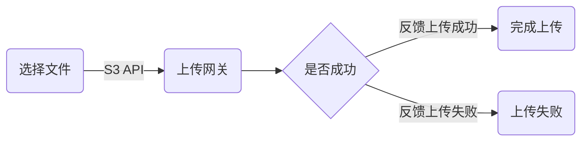
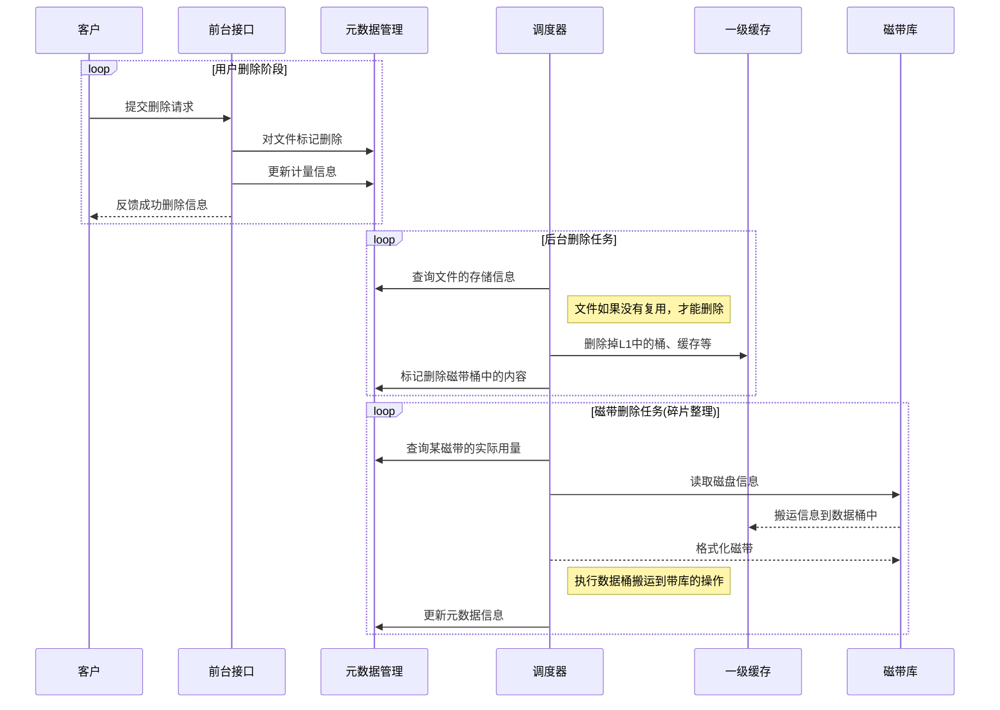
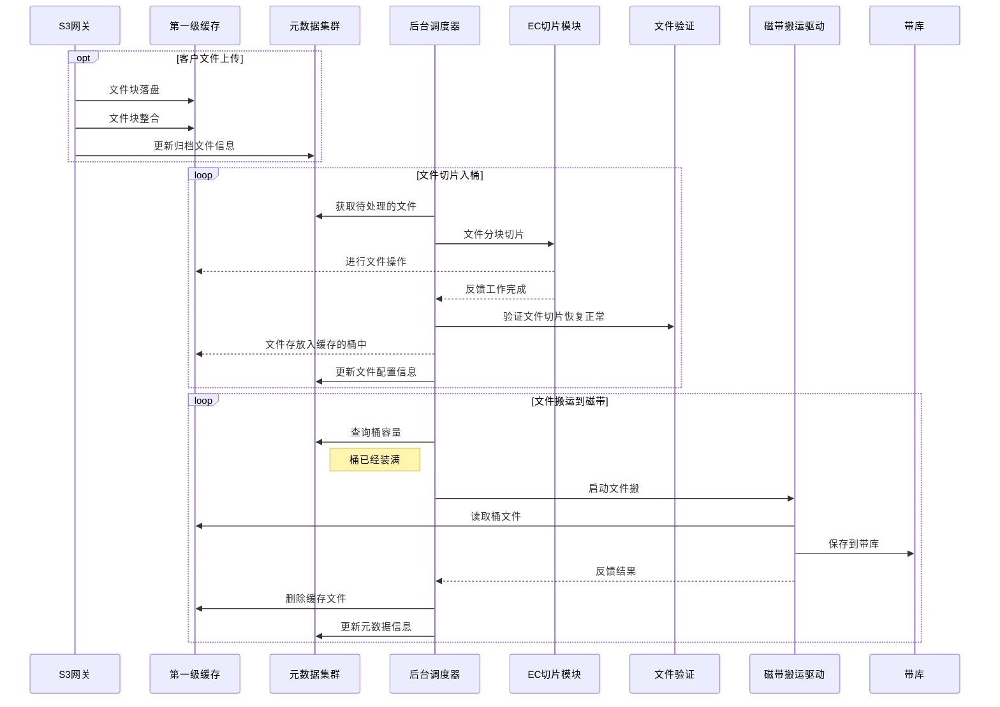

==冰山存储总体设计==

# 主要业务流程

## 冰山存储业务介绍

冰山存储是一个数据冷备份服务，对外提供S3文件对接接口，实现对备份文件的长期存储。冰山存储是一个低成本的长期存储，所以业务主要有如下的特点：

- 数据可以随时存储，但是读取需要有预约
- 数据存储便宜，可以做到100元/TB/年
- 对于备份的数据，随时会在后台进行检查，保证数据有效性
- 为了降低成本，使用纠删码保存数据
- 对外提供云存储中实施标准的S3接口进行读写
- 提供查询等方面的API

## 客户使用流程

### 上传文件

上传文件主要有两种方式：直接上传、分片上传

直接上传的流程如下：



直接上传通常用于网速特别好、网络质量特别好、文件长度不大的情况（文件长度小于100M）的情况。

如果文件比较大，则必须使用分片上传，分片上传大致的流程是：

```flow
pick_file=>start: 选择要上传的文件
slice_file=>operation: 准备文件分片长度、大小
start_head=>operation: 发布文件上传初始信息
upload_slice=>operation: 分片上传文件(可并发)
is_finish=>condition: 是否完成
upload_eof=>operation: 结束分片上传
is_file_done=>condition: 文件信息完整正确
check_lost_chunk=>operation: 重新准备要上传的块
upload_end=>end: 结束上传

pick_file->slice_file->start_head->upload_slice->is_finish
is_finish(yes)->upload_eof
is_finish(no)->upload_slice
upload_eof->is_file_done
is_file_done(yes)->upload_end
is_file_done(no)->check_lost_chunk->upload_slice
```

首先文件分片以后，根据文件分片的顺序和ID，分块上传文件，每个文件块应该控制在100M以内，全部文件完成上传后会进行核查是否所有文件都全部完成了上传，如果有部分文件没有上传完毕或者上传损坏，则应该重新上传。

文件在上传之前，会提供一个校验和、文件长度等信息，方便最终确认文件上传成功。

在每一个文件块上传的时候，也要提供文件块的校验和信息，每次文件块上传，都要专门校验。

### 提取文件

提取文件主要分为三个流程：申告阶段、下载阶段、完成下载。

- 申告阶段：通过API调用，传入一个具体的文件的提取请求
- 准备阶段：接到请求后，系统后台开始尝试从带库或者缓存盘中找到这个文件对应的块，完成恢复文件所需要的块的准备之后，恢复该文件，并且给客户准备一个指定的下载位置。
- 下载阶段：客户通过http请求，下载这个文件。
  - 完成下载：客户要通过API通知，提醒把这个临时指定的下载文件删除掉。默认这个文件只有48小时的存在时间，如果超过了会自动从缓存盘中删除，客户可以通过API延长这个时间。							

### 删除文件

通过API，可以直接删除文件。一旦提交了文件删除请求，则系统会直接删除文件。

### 浏览文件

根据客户侧的bucket，直接浏览bucket的文件，文件可以根据所在不同目录来浏览。

## 运营管理


# 主要流程实现

## 重要概念

- **一级缓存**

SAN存储首先划分成LUN，LUN映射到NFS服务器中，作为NFS的盘映射出来。然后NFS的盘会挂载到S3网关中，成为S3网关中的某一个目录，同样这个NFS的文件目录也会共享给磁带分片、磁带缓存等服务器角色，共享使用。

- **桶**

 桶是在缓存中对磁带某个Block区域的一个映射，对应起来就是一个一级缓存的LUN形成的目录。

- **上传文件块**

上传的文件块以文件形式保存在缓存中

- **磁带库**

冷备文件的最终存储仓库，有机械臂、磁带驱动器等，提供足够的读写能力

- **磁带占用空间**

因为磁带是向前追加写的，所以磁带一旦有写入，都会产生占用空间。在文件标记删除的时候，磁带占用空间不会变化。

只有磁带在完成整盘内容搬走，格式化之后，磁带占用空间才会重置。

- **磁带有效使用空间**

磁带的占用空间中，抛开已经标记删除的空间，实际有效使用的空间。

- ​

### 服务器角色

**S3网关**

对客户的对外接口

**调度器**

综合业务调度器，基于协程的调度，支持后台任务的综合型并发任务

**元数据集群**

使用TiDB数据库，保存各种文件信息，包括文件位置、分片位置、桶配置信息、对应磁带Block配置信息

**NFS服务器**

基于SAN存储的LAN，映射NFS磁盘

**文件分片服务**


**文件校验服务**


**文件搬运服务**


**磁带维护服务**


## 文件在系统中的生命周期

文件在系统中主要有如下一些生命周期：

**文件保存的处理过程**：


**文件提取流程**：

客户需要提取文件的时候，应该事先对系统中提交读取请求，等待请求就绪之后，才能下载。

在下载完成之后，可以调用API来删除掉这个临时的副本，也可以等待48小时之后，系统自动删除。

如果客户本身在48个小时内还无法下载文件，则需要收取文件的空间占用费，并且需要调用API来申请把文件的保留时间延长。


**文件删除**：

当用户不需要该归档文件之后，可以提交删除的请求，这个删掉的文件应该立刻停止计费，然后延时在后台删除。



## 核心任务

### 文件上传



### 文件下载


### 磁带空间整理

磁带空间在有一定空额之后，需要进入空间整理流程。空间整理是一个后台进程。

## 异常处理流程

### 客户上传文件到一半的时候删除

## 维护性任务

### 磁带碎片整理

### 磁带可用性验证

### 磁带倒带检查


.jpg)

## 性能优化任务

### 基于用户层面的磁带碎片整理

### 基于分代管理的任务


# 业务限制和规则

## 上传完整性校验

直接上传：检验检验和

分段上传：分段校验和及完整文件校验和

## 文件上传阶段的限制

### 直接上传

​ 直接上传建议文件小于100M（**AWS S3**允许直接上传的文件大小为**5GB**，   **AWS Glacier**允许直接上传文件大小为**4GB**，     **阿里云归档存储**允许直接上传的文件大小为 **6G**）

### 分段上传

**AWS S3：**

文件大于100M则建议分段上传

分段大小：1M~5GB（最后一段可<1M)

每次分段上传的分段的最大数量：10000

最大档案大小：4 GB*10000=40000GB=39.0625T

分段上传完成后需用户发送完成终止上传请求


（**AWS Glacier**:分段大小：1M~4G，段大小必须为1M * 2的幂）

**（阿里归档存储**：分段大小：32M~4G）

### 断点续传（阿里：直接上传不提供，分段上传可续传Multipart Upload任务）

​       **Multipart Upload续传：**

​        在中断分段上传前记录 upload_id 或者恢复前查询 upload_id，用于恢复时任务匹配，同时恢复时间必须在一开始创建多段上传任务后的24小时内。

  recover_uploader（续传指定的任务）

## 文件下载阶段限制

​     用户需发送下载请求，根据请求类型确定准备完成时间。

​     在系统数据准备完成通知用户48h内取回数据，超过48h则删除数据。

​     **用户可购买加急包加快取回速度**。（阿里不提供，AWS Glacier有预置性能包业务）

## 内部的规格和限制

内部桶：100GB一个，暂定装满95%~98%后迁移数据

## 磁带前向追加限制

按照规格，每盘磁带(12T)可划分为120个Block，每个Block为100GB。

磁带是不能重写的，原始文件如果出现了变更，则原有的文件直接失效，整体文件会重新在系统中保存，占用新的空间，老的空间在系统中标记为不可用，等待后台的回收任务回收空间。

## 空间信息统计

对于数据的统计是后台异步执行，空间信息每1天执行一次更新


!(https://github.com/hourenhao/personal)/**1520319732(1).jpg**)

## 用户行为：

-  用户直接上传 <100M文件：

   ​        用户指定上传位置--开始上传--上传完成--纠删码切块--完整性校验--存入磁带--删除缓存区数据

- 用户上传>100M文件：

  ​        用户启动分段上传任务 -->将文件分段-->上传-->部分上传完成-->全部上传完成-->用户发送完成分段上传请求-->将文件合并-->检验文件校验和-->纠删码编码-->校验-->内部bucket--存入磁带--> 删除缓存区数据

  ```mermaid
  graph LR
  用户启动分段上传任务 --> 将文件分段
  将文件分段--> 上传 
  上传--> 部分上传完成
  部分上传完成-->全部上传完成
  全部上传完成-->用户发送完成分段上传请求
  用户发送完成分段上传请求-->将文件合并
  将文件合并-->检验文件校验和
  检验文件校验和-->纠删码编码
  纠删码编码-->校验
  校验-->内部bucket
  内部bucket-->存入磁带
  存入磁带--> 删除缓存区数据
  ```


- 用户下载数据：

  ​        发送下载请求--系统从磁带读取数据--在冗杂恢复块中恢复文件--准备完成后通知用户（可关联邮箱提醒）--用户下载数据

- 用户删除数据：
  ​         发送删除请求--删除


# 常见问题：

## 调用接口失败的收费问题：

​       根据调用接口返回状态收费，如返回状态码为2XX则收费，其他(如3XX，4XX，5XX)不收费。

## 用户上传完成之前停止上传

​        断点续传的制定标准（不上传和断点续传的区分）

## 用户启用分段上传但未发送完成请求

## 用户发送下载请求后未下载数据：

​        文件48h后自动删除，可通过API延长文件存在时间

## 系统问题

⽂件排重 ：

⽂件分⽚ ：分片与验证

冗余编码与验证：

备份块整合搬运 

损坏块重建恢复 

磁带碎⽚整理

备份⽂件提取 

磁带可⽤性校验 

⽂件访问性优化

⽂件分⽚

 冗余编码与验证
备份块整合搬运 

损坏块重建恢复 磁带碎⽚整理
备份⽂件提取 磁带可⽤性校验 ⽂件访问性优化


